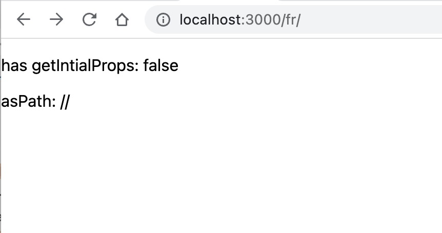
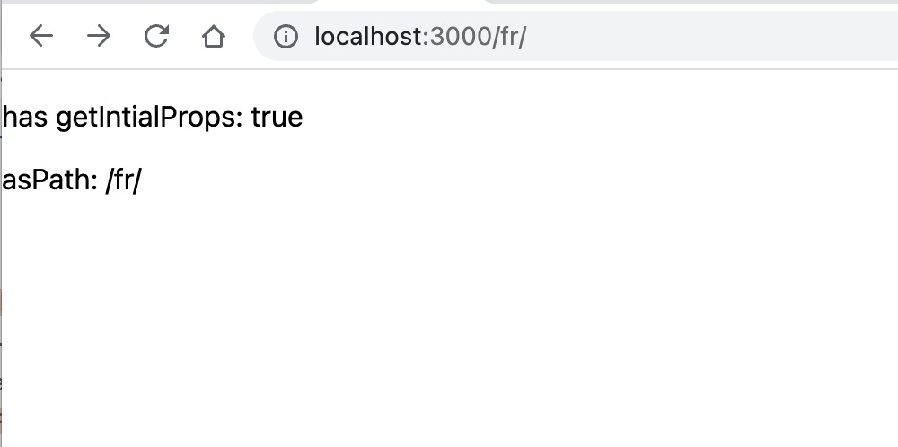

# Bug description

When using a custom server and using i18n there is a some weird behaviour where the asPath where it returns an invalid url or `//`. A reproducable example is in this repo.

When we use a custom server with nextjs and i18n setup, when loading a locale we see that the asPath property is `//`:



The code that causes this issue is [here](https://github.com/vercel/next.js/blob/canary/packages/next/src/server/base-server.ts#L1321-L1328) and the problem is that `urlPathname === /fr` and `resolvedUrlPathname === '/'` so when we check if we need to add a trailing slash, we check the `urlPathname` pathname and then use `resolvedUrlPathname` to append the trailing slash to.

The two variables diverge at the [following point](https://github.com/vercel/next.js/blob/canary/packages/next/src/server/base-server.ts#L1213-L1217) and this causes the two to evaulate to:

```javascript
urlPathname = "/fr";
resolvedUrlPathname = "/";
```

which we then essentially do:

```javascript
if (urlPathname !== "/" && this.nextConfig.trailingSlash) {
  resolvedUrl = `${resolvedUrlPathname}${hadTrailingSlash ? "/" : ""}`;
}
```

so we end up with `resolvedUrl = '//'`

---

We can partially "fix" this by adding an `getInitialProps` method to our page which causes the [following](https://github.com/vercel/next.js/blob/canary/packages/next/src/server/base-server.ts#L1349-L1354) block to execute and outputs `/fr/` _however_ this url is still wrong as `asPath` is meant to strip the URL locale from the url:


